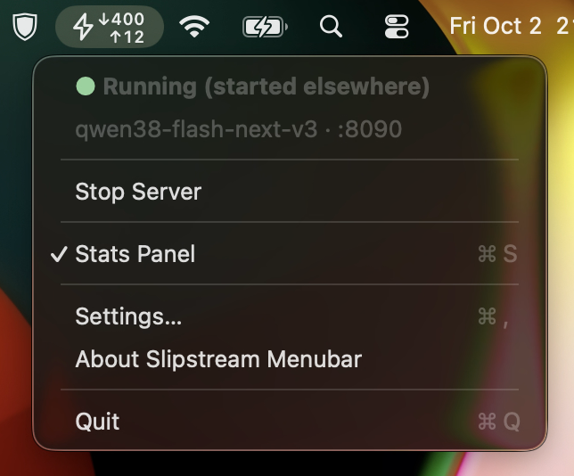
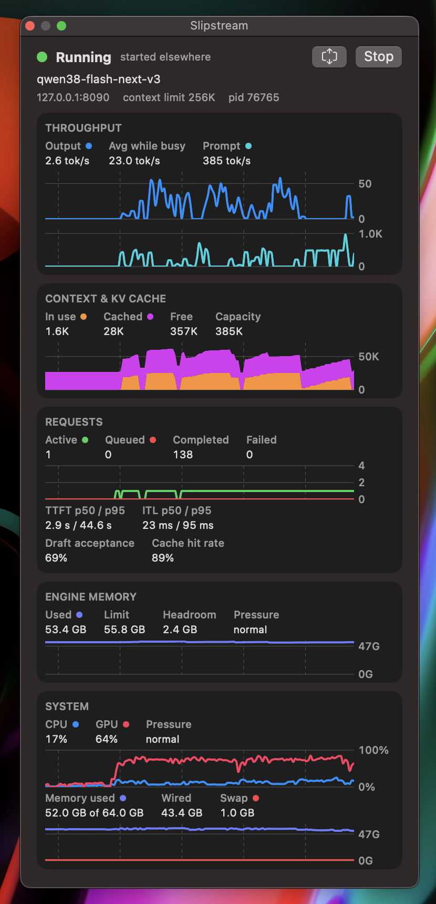

# Slipstream Menubar

A macOS menu bar item that starts, stops and watches a local
[Slipstream](https://github.com/npanj/slipstream) server, with a floating panel of
live serving and system charts. The menu design follows
[oMLX](https://github.com/jundot/omlx)'s menu bar app, reduced to the essentials.

The item shows Slipstream's bolt and, while serving, two live readouts in the style of
[Vorssaint](https://github.com/vorssaint/vorssaint-utils)'s network indicator: ↓ prompt
tokens per second (incoming) over ↑ output tokens per second (outgoing).

<p>
  
  &nbsp;
  
</p>

## Download

From the [latest release](https://github.com/mzinner/slipstream-menubar-item/releases/latest), get
either `Slipstream-Menubar.app.<version>.dmg` (open it and drag the app onto *Applications*) or
`Slipstream-Menubar.app.<version>.zip` (unzip it and move *Slipstream Menubar.app* to
/Applications). The app is signed ad hoc, not notarized, so allow it once in *System Settings →
Privacy & Security → Open Anyway*, or run
`xattr -dr com.apple.quarantine "/Applications/Slipstream Menubar.app"`.

## Slipstream itself

The app runs the Slipstream it finds at `~/.local/bin/slipstream`, else `slipstream` on your
login shell's PATH. If there is none, the menu offers **Install Slipstream…**: it downloads the
latest release of [mzinner/slipstream](https://github.com/mzinner/slipstream/releases), shows the
progress, verifies the checksum, installs into `~/.local/share/slipstream/<version>` and links
`~/.local/bin/slipstream`, keeping the two newest versions, as the release's `install.sh` does:

```sh
curl -fsSL https://github.com/mzinner/slipstream/raw/main/install.sh | sh
```

Settings → Server → Run can switch to a source checkout instead.

## Models

**Download Model…** in the menu, and Settings → Model, offer the supported models:

| Model | Download | Memory |
|---|---|---|
| Swift-Qwen3.8-Flash-Next V3 (GGUF, plus the shared MTP draft head) | 104.5 GB | 64 GB Mac |
| Qwen3.8-Flash-Next V3 (GGUF) | 104.5 GB | 64 GB Mac |

The Slipstream v2 engine loads only Qwen3.8-Flash-Next. The `incoai/Qwen3.8-27B-Splash` and
`Qwen3.6-35B-A3B-Splash` packages its launcher still lists, from Splash 1.0, fail with "unsupported
weight format".

**New Model…** takes any Hugging Face id and checks it first: a ready-to-run Slipstream package
in the format the engine loads (`splash-packed-q4-qwen4exp`), or GGUF files of the `qwen4exp` architecture (read from
the first shard's header, without downloading it). Downloads use Hugging Face's `hf`, installed
with Homebrew when missing, and show progress, speed and time left; at least 10 GB must stay free
afterwards. GGUF models are converted on their first start, which the panel shows as a progress bar.
On a 64 GB Mac the app raises `iogpu.wired_limit_mb` (Settings → Memory, default 59392) before
each start.

## Requirements

- macOS 15 or later on Apple Silicon (the Slipstream engine itself needs 26.4)
- Xcode or the Command Line Tools with Swift 6
- Slipstream: installed by the app or `install.sh`, or a built source checkout

## Build and run

```sh
make test      # unit tests for the core logic
make app       # build/Slipstream Menubar.app, signed ad hoc
make run       # build and open it with the stats panel showing
make install   # copy it to /Applications
```

On first launch, Settings opens if no model is set. The configuration is stored in
`~/Library/Application Support/Slipstream/menubar.json`, and the API key in the login
Keychain.

## How it works

- **Status.** The launcher records its pid, model and port in
  `<checkout>/build/runtime/serve.lock` and then `execve`s into `server/server.py`, so
  that pid is the server. The app reads the lock, checks that the pid is a live
  Slipstream launcher or server, and probes `/health` and `/ready`. A server started from
  a terminal is found the same way and is shown as "started elsewhere".
- **Start.** Runs `<checkout>/slipstream serve --model … --port … [options]` in its own
  session with output to `~/Library/Logs/Slipstream/server.log` (the previous log is kept
  as `server.log.1`). While a GGUF model is being prepared, the status shows the
  converter's progress from the log.
- **Stop.** SIGTERM, then SIGKILL if the server is still running after 30 seconds.
  Force Stop sends SIGKILL right away.
- **Quit** leaves the server running; the next launch picks it up again.
- **Stats.** `/metrics` every two seconds while serving, every three
  seconds otherwise, plus `/status` every 15 seconds for the context limit. Token rates
  are counter deltas over a three-second wall-clock window. The engine's own
  `*_tokens_per_second` gauges divide by GPU step time and read far higher than what
  clients receive. History is kept when metrics stop arriving; the stretch without data
  is shaded gray and lines are not drawn across it.
- **Liveness.** `/ready` only decides when a starting server counts as running: once
  loaded, the server answers 503 there whenever it is saturated. After that, "Not
  responding" means three failed `/health` checks in a row.
- **System.** CPU from per-core tick counters, GPU utilization from the accelerator's
  IOKit `PerformanceStatistics`, memory from `vm_statistics64`, swap from
  `vm.swapusage`: public APIs only, no helper or entitlements.

## Settings

| Setting | Passed as |
|---|---|
| Slipstream checkout | where `slipstream` is run from |
| Model | `--model` (GGUF folder, prepared package, or Hub repo id) |
| Port | `--port` |
| Max context | `--max-context` (empty = auto) |
| Max memory | `--max-memory` (empty = auto) |
| API key | `SLIPSTREAM_V2_API_KEY` in the server's environment; also sent by the app to read `/metrics` |
| Listen on the network | `--host 0.0.0.0` (off: 127.0.0.1 only); needs a launcher with `serve --host` ([npanj/slipstream#5](https://github.com/npanj/slipstream/pull/5)) |
| Allowed hosts | `--allowed-host`, repeated: extra names clients may use, such as `<mac>.local` |
| Disable web UI | `--no-webui` |
| Start the server when the app launches | only if none is running already |
| Open at login | a login item via `SMAppService` (needs the app in /Applications) |

With the network option on, other machines connect to `http://<this Mac's IP>:<port>`;
Settings lists the addresses and warns while no API key is set. Traffic is plain HTTP.

Changes take effect when the server restarts; Settings offers Save & Restart while one
is running.

## Layout

```
Sources/SlipstreamMenubarCore/   metrics parsing, rates, status logic, config, system sampling
Sources/SlipstreamMenubar/       AppKit menu, server control, SwiftUI panel and settings
Tests/SlipstreamMenubarCoreTests/
scripts/build-app.sh             assembles and signs the .app bundle
scripts/fake-server.py           stand-in Slipstream server for testing (outages, busy, served requests)
scripts/make-icon.swift          draws Resources/AppIcon.icns from the bolt
```

## Releases

Pushing a tag such as `v26.10.0` runs `.github/workflows/release.yml`: it tests, builds the app
with that version, and attaches a `.dmg`, a `.zip` and their SHA-256 sums to a GitHub release.
Running the workflow by hand with an existing tag rebuilds that release's files.

## License

MIT, © 2026 Mike Zinner ([mzinner](https://github.com/mzinner)).
